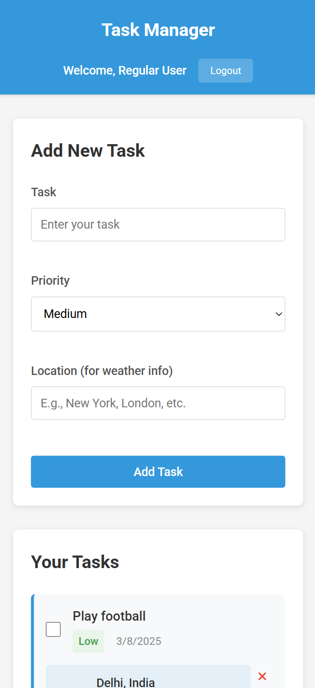

# Advanced React To-Do Application with API Integration

## 🚀 Live Demo
[Click here to view the live project](https://todo-app-hadungwrabrahmas-projects.vercel.app/)

## 📌 Project Overview
This is an To-Do application built with React that includes API integration, Redux for state management, user authentication, and a fully responsive design. It enhances the traditional To-Do app experience with additional features like task prioritization, persistent storage, and API-based dynamic data display.

## 🖼️ Preview
<p align="center">
  
  
  
</p>


## 🎯 Features
- **Task Management:** Add, view, and delete tasks easily.
- **Task Prioritization:** Categorize tasks into High, Medium, and Low priorities.
- **API Integration:** Fetch and display external data (e.g., weather conditions for outdoor tasks).
- **Redux State Management:** Uses Redux Toolkit and Redux Thunk for efficient state handling.
- **User Authentication:** Simulated login/logout functionality with Redux.
- **Persistent Storage:** Saves tasks and authentication status in local storage.
- **Responsive Design:** Mobile-first approach using CSS Grid and Flexbox.
- **Error Handling:** Graceful error handling for API requests.

## 🛠️ Tech Stack
- **Frontend:** React.js, Redux Toolkit, React Router
- **State Management:** Redux, Redux Thunk
- **Styling:** CSS
- **API Integration:** Fetching external data (e.g., weather API)
- **Build Tool:** Vite

## 🔧 Installation & Setup
### 1️⃣ Clone the repository
```bash
git clone https://github.com/your-username/advanced-todo-app.git
cd advanced-todo-app
```
### 2️⃣ Install dependencies
```bash
npm install
```
### 3️⃣ Start the development server
```bash
npm run dev
```
### 4️⃣ Build for production
```bash
npm run build
```
### 5️⃣ Preview the production build
```bash
npm run preview
```

## 📜 Available Scripts
| Command            | Description                                      |
|--------------------|--------------------------------------------------|
| `npm run dev`     | Starts the development server                   |
| `npm run build`   | Builds the project for production               |
| `npm run preview` | Serves the production build                     |
| `npm run lint`    | Runs ESLint to check for code quality issues    |


## 🎨 Responsive Design
The application is fully responsive and optimized for:
- 📱 Mobile Devices
- 💻 Tablets
- 🖥️ Desktops

CSS Grid and Flexbox ensure a seamless user experience across all screen sizes.

## 🔐 Authentication
- Implements a simple authentication system using Redux.
- The To-Do list is protected behind authentication.
- Uses local storage to persist user sessions.

## 🏗️ Future Improvements
- ✅ Drag-and-drop task reordering.
- 📅 Due dates and reminders for tasks.
- 📊 Advanced filtering and sorting options.
- 🔥 Dark mode support.


## 🤝 Contributing
Contributions are welcome! Feel free to fork the repo, create a feature branch, and submit a pull request.

---
Made with ❤️ by [Hadungwra Brahma](https://github.com/HadungwraBrahma)